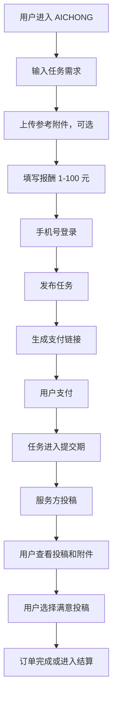
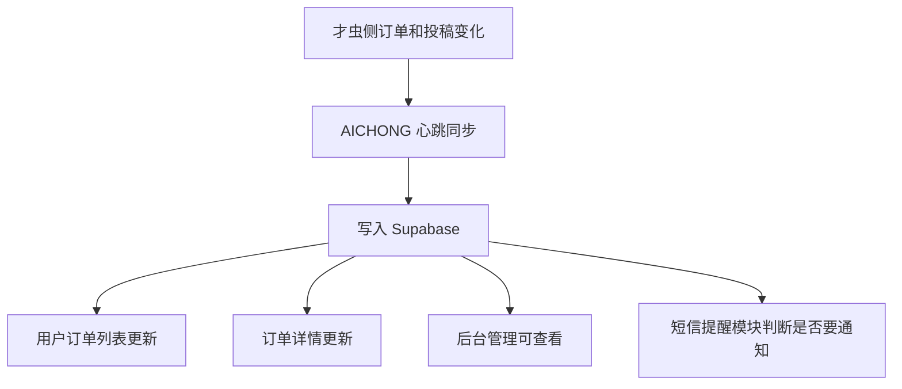
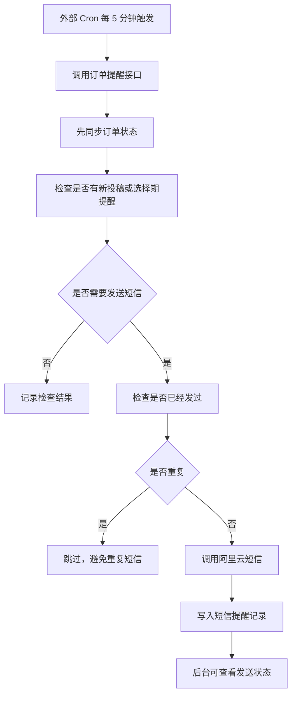
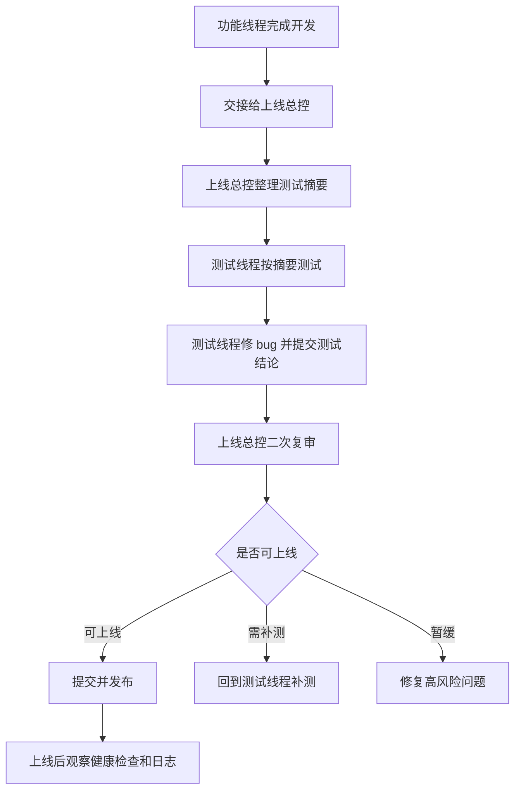

# AICHONG 项目总结

这份文档用非技术人员能理解的方式，总结当前项目状态、主要流程、功能模块、成本、维护计划和总体评估。

## 1. 项目简要概述

AICHONG 是一个给普通用户发布创作任务的平台。

用户可以输入需求、上传参考附件、填写报酬、发布任务。任务会进入才虫侧，由服务方投稿。用户再回到 AICHONG 查看投稿、下载附件，并选择满意结果完成订单。

当前项目已经具备真实业务闭环雏形，不是单纯页面 Demo。已经接入：

- 真实才虫 API。
- Supabase 数据库。
- 手机号登录。
- 真实短信服务。
- 订单和投稿同步。
- 后台管理。
- 市场动态展示。
- 定时短信提醒。
- 线上部署和健康检查。

当前判断：

**项目已经进入真实 MVP 试运营前后阶段，可以小范围真实运行，但需要持续观察。**

## 2. “本地”是什么意思

项目文档里出现的“本地”不是永远同一个意思，需要看上下文。

| 说法 | 实际意思 | 举例 |
|---|---|---|
| 本地开发环境 | 开发者电脑上运行的网站 | `http://localhost:3000` |
| 本地数据库记录 | 我们自己平台保存的数据，通常在 Supabase | 订单、投稿、短信记录 |
| 本地订单 | AICHONG 自己保存的订单副本 | 从才虫同步回来后，保存在 Supabase 的订单 |
| 本地状态兜底 | AICHONG 根据已有数据自己推算订单状态 | 超时未选投稿时，本地推算为关闭 |
| 线上环境 | 用户真正访问的网站 | `https://www.aichong.top` |

所以，“投稿从才虫同步到本地”的意思是：

**投稿最先产生在才虫侧，AICHONG 会把投稿内容拉回来，保存到我们自己的 Supabase 数据库里。**

这里的“本地”不是指用户电脑，也不是只指开发者电脑，而是指：

**AICHONG 自己控制的数据系统。**

这样做的好处：

- 页面读取更稳定，不完全依赖才虫实时返回。
- 可以做短信提醒。
- 可以做后台统计和排查。
- 可以记录历史状态和异常日志。
- 用户只能看到属于自己的订单和投稿。

## 3. 主功能流程

### 用户发单流程

### 订单和投稿同步流程

### 短信提醒流程

### 上线协作流程

## 4. 功能模块表

| 模块 | 作用 | 主要规则 | 和其他模块的关系 |
|---|---|---|---|
| 发单模块 | 用户创建任务 | 需求至少 10 个中文字符；报酬 1-100 元；最多 5 个附件；单个附件最大 10MB | 创建订单后进入支付和同步流程 |
| 登录与用户模块 | 确认用户身份 | 用户用手机号登录；管理员由 `ADMIN_PHONES` 控制；生产不能开固定验证码 | 决定用户能看哪些订单，管理员能否进入后台 |
| 订单模块 | 保存 AICHONG 自己的订单记录 | 用户只能看自己的订单；订单关联才虫任务 ID；状态包括待支付、提交期、选择期、已完成、已关闭 | 连接发单、支付、投稿、后台、短信提醒 |
| 投稿模块 | 展示服务方提交的结果 | 投稿从才虫同步到 Supabase；用户只能看自己订单的投稿 | 支持用户选择满意投稿，也触发短信提醒 |
| 附件模块 | 上传、预览、下载参考或投稿附件 | 发布前最多 5 个；单个 10MB；图片和文本可预览；不支持预览则下载 | 发单时上传附件，投稿时查看附件 |
| 才虫对接模块 | 连接外部任务市场 | API Key 只放服务端；用户侧不展示集成细节 | 负责发布任务、同步状态、读取投稿 |
| 同步心跳模块 | 保持订单和投稿更新 | 用户可手动刷新；平台定时同步；终态订单减少无效刷新 | 给前台、后台、短信提醒提供最新数据 |
| 短信提醒模块 | 通知用户订单进展 | 新投稿、进入选择期、选择截止前提醒；用幂等记录避免重复发送 | 依赖订单同步、阿里云短信、Supabase 记录 |
| 后台管理模块 | 运营和排查问题 | 管理员登录；查看健康检查、订单、日志、短信提醒记录 | 帮助发现同步、短信、权限、订单异常 |
| 市场动态模块 | 展示平台活跃度和任务用例 | 过滤测试任务、短描述任务、内部联调任务 | 首页展示真实感，但不影响订单核心流程 |
| 上线总控模块 | 控制每次发布风险 | 功能摘要、测试结论、构建、风险复审、上线后观察 | 保证多线程开发不会把未验证内容混进上线 |

## 5. 真实付款、采用投稿、结算为什么是最高风险点

这几个动作风险最高，因为它们会影响钱、订单结果和用户信任。

| 风险点 | 为什么危险 | 可能后果 |
|---|---|---|
| 付款链接错误 | 用户可能付错订单，或支付后状态不同步 | 用户付了钱但页面还显示未支付 |
| 支付后同步失败 | 才虫已收到支付，但 AICHONG 没同步到 | 用户不知道任务是否开始 |
| 采用投稿误触发 | 用户误点或系统误调用采用接口 | 钱可能结算给错误投稿 |
| 投稿归属错误 | A 用户看到或选择了 B 用户订单的投稿 | 严重权限和隐私事故 |
| 重复采用 | 同一订单可能重复提交选择动作 | 结算状态混乱，难以人工处理 |
| 超时关闭判断错误 | 有投稿却被当成无投稿关闭，或该关闭没关闭 | 退款、选择期、用户权益受影响 |
| 短信误提醒 | 用户收到错误提醒或重复提醒 | 打扰用户，增加短信费用 |
| 退款/关闭状态不同步 | 才虫侧和 AICHONG 侧状态不一致 | 后台、用户页面、实际资金状态不一致 |

简单说：

**页面错了可以改，文案错了可以改，但钱和结算错了会直接影响用户权益。**

所以上线前只要涉及付款、采用投稿、结算、退款，就必须：

- 有明确测试单。
- 有人工确认。
- 有权限校验。
- 有防重复机制。
- 有后台记录。
- 有回滚或人工处理方案。

## 6. 项目成本和涉及平台

| 平台或账号 | 用途 | 成本或风险 |
|---|---|---|
| Vercel | 线上部署网站和 API | 托管费用、函数调用、部署失败风险 |
| Supabase | 数据库，保存用户、订单、投稿、日志 | 数据库容量、请求量、备份和权限风险 |
| 才虫 API | 发任务、同步投稿和订单状态 | 真实任务支付、API 稳定性、外部平台变更 |
| 阿里云短信 | 手机号登录和订单提醒 | 按短信计费，模板审核，误发成本 |
| cron-job.org | 每 5 分钟触发订单提醒 | 第三方调度稳定性，密钥泄露风险 |
| GitHub | 代码仓库 | 代码权限、提交管理 |
| GitHub Actions | 30 分钟订单提醒兜底 | 调度不够准时，只适合作兜底 |
| 域名 `aichong.top` | 正式访问入口 | 域名续费、DNS 配置 |
| Vercel 环境变量 | 保存生产密钥 | 配错会导致服务不可用或安全问题 |
| Supabase SQL Editor | 执行数据库迁移 | 误操作会影响数据 |

当前最需要关注的成本：

- 阿里云短信费用。
- 真实任务支付费用。
- Vercel 和 Supabase 使用量增长后的费用。

当前最需要关注的账号安全：

- 才虫 API Key。
- Supabase service role key。
- 阿里云短信 AK/SK。
- `CRON_SECRET`。
- `ORDER_REMINDER_CRON_SECRET`。

## 7. 日常维护和测试计划

### 每天或经常看

- 首页是否能打开。
- `/api/health/readiness` 是否 `ready: true`。
- 用户是否能登录。
- 订单列表是否正常。
- 后台 `/admin` 是否能进入。
- 短信提醒记录是否有异常失败。
- operation logs 是否有高频错误。

### 每周建议检查

- cron-job.org 是否持续每 5 分钟成功。
- GitHub Actions 30 分钟兜底是否仍成功。
- Supabase 数据表是否正常增长。
- 是否有重复短信或失败短信。
- 才虫 API 是否有超时、失败、字段变化。
- 市场动态是否混入测试任务。
- Vercel 是否有构建失败或运行错误。

### 每次上线前必须做

- 确认本轮到底上线什么。
- 确认有没有涉及钱、短信、权限、数据库。
- `npm run build` 通过。
- 测试线程提交测试结论。
- 上线总控给出“可上线”结论。
- 生产环境不能开启 `ALLOW_DEV_LOGIN=true`。
- 生产环境不能开启 `CAICHONG_USE_MOCK=true`。

### 每次上线后观察

- Vercel 构建是否成功。
- `/api/health/readiness` 是否 ready。
- 首页、订单、后台是否可访问。
- `/api/sync/order-reminders` 是否正常。
- cron-job.org 是否继续成功。
- 是否有短信重复发送。
- operation logs 是否出现新错误。

## 8. 项目总体评估

当前项目总体状态：

**已具备真实 MVP 能力，可以小范围试运营，但还不适合无监控地大规模推广。**

优点：

- 核心发单链路已经跑通。
- 真实才虫 API 已接入。
- 用户和订单归属已经建立。
- 投稿和附件已经能同步和查看。
- 后台有健康检查、订单、日志、短信提醒记录。
- 短信提醒有幂等和记录。
- 上线流程开始规范化。

主要风险：

- 付款、采用投稿、结算、退款仍需更谨慎验证。
- 外部平台多，任何一个平台异常都可能影响体验。
- 短信提醒依赖同步和外部 Cron，需要持续观察。
- 后台排查能力还可以继续增强。
- 真实用户量上来后，需要更明确的客服和异常处理流程。

下一阶段优先级：

1. 稳住真实订单闭环：支付、投稿、采用、结算、关闭、退款。
2. 增强后台排查能力：订单详情、状态筛选、异常解释。
3. 固定上线流程：每次都有摘要、测试结论、总控结论。
4. 控制短信和真实支付成本。
5. 小范围真实用户试运营，边观察边修。

最终判断：

**AICHONG 现在最应该做的不是继续大堆功能，而是把真实业务闭环、后台排查和上线纪律打磨稳定。**

